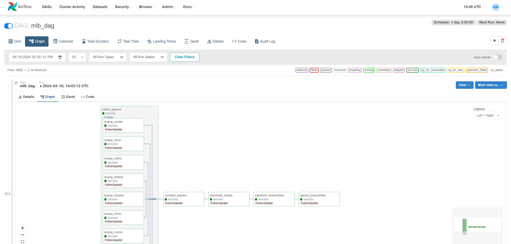

# Side project to create ETL MLB data pipeline

The goal of this project is to create an automated process that collects hitters' pitch data and transforms that data into business intelligence analytics that can be used to show how well a team/players are performing.

This project uses Airflow as the ETL orchestration tool. I created a local and cloud environment to act as my development and production environments. Both local and cloud environments are using Docker Compose files to run Airflow on Docker. The production cloud environment is scheduled with lambda functions to run daily and update the data with yesterday's game. I used an S3 bucket to store data for the Power BI dashboard to read from. 

Here is what the different steps in the Airflow DAG look like.

This is the PowerBI dashboard that shows some stats for the team and players.

This was something extra that I decided to add to the project. I used a Python module, turtle, to take the dataset that I created and draw out what the scorebook would look like for a selected game. 
